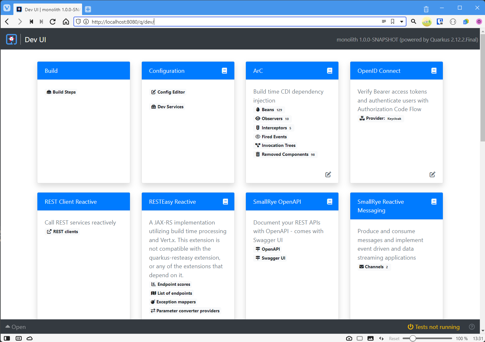
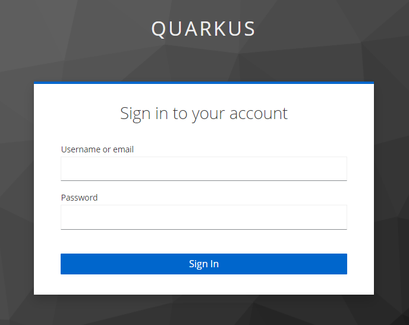
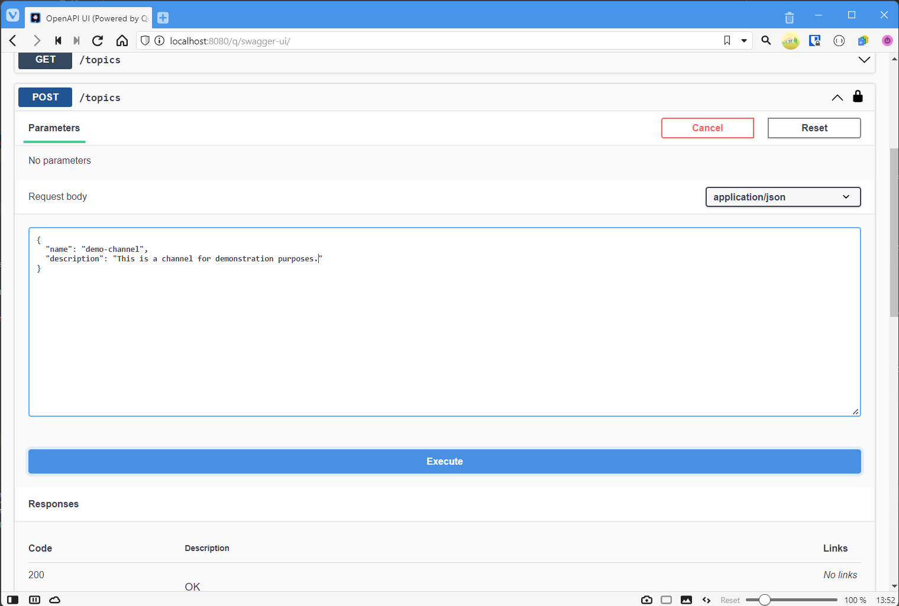
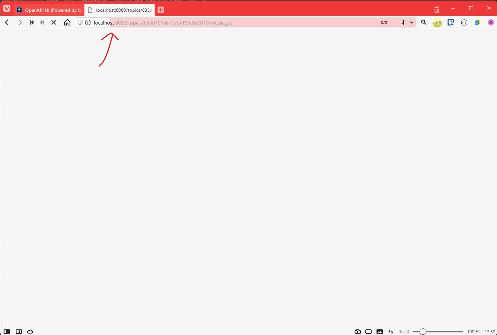
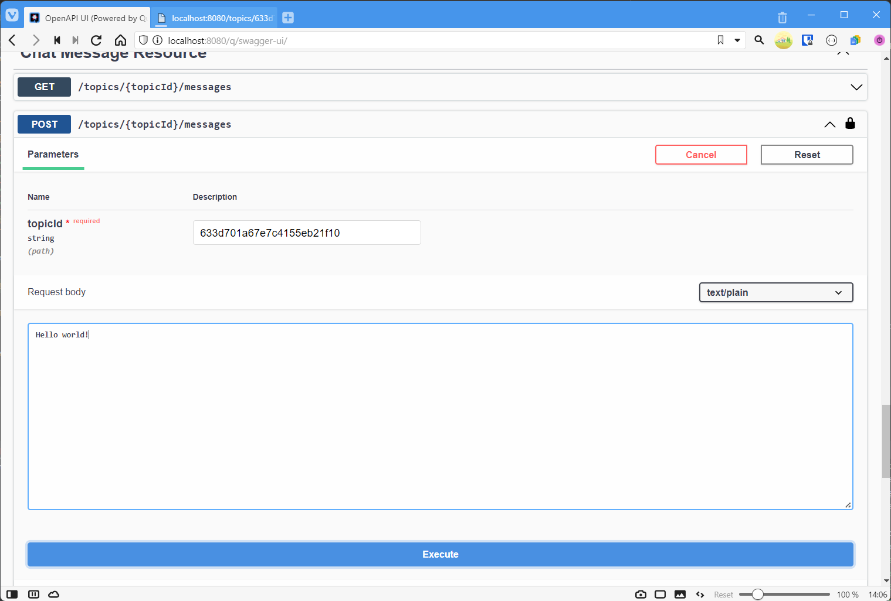
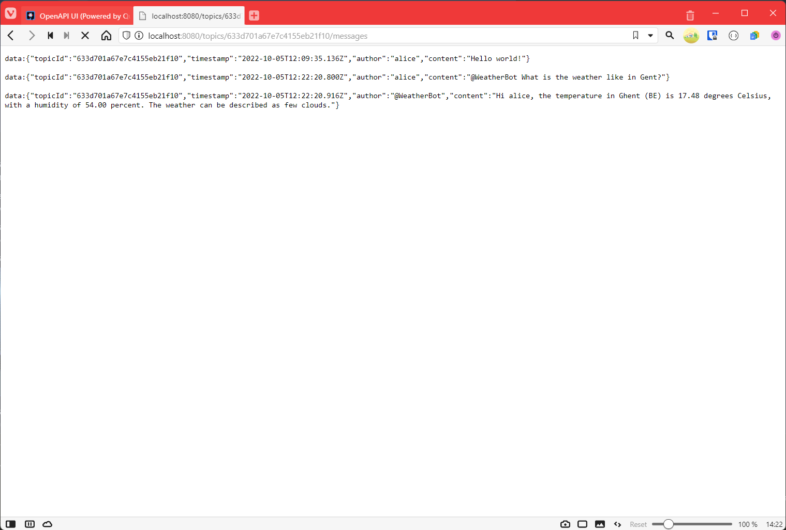

# Demo application walkthrough

This page walks you through the functionality of the demo application.

## Starting the server

The easiest way to launch the entire application locally, is by executing the monolith, via one of the following options:

* Executing `gradle monolith:quarkusDev` in a shell attached to the workspace
* Via the 'debug' button next to the monolith module in the "Java Projects" pane
* Via the 'play' button to the left of the main method in the `Launcher` class of the monolith module

Each of these option, will result in Quarkus launching in **development mode**. This has the implication that by default, Quarkus will launch the required dependencies (MongoDB, Keycloak, Kafka) automatically as containers. This feature is called [Quarkus Dev Services](https://quarkus.io/guides/dev-services) (not to be confused with development containers used for setting up the workspace) and is one of the ways in which Quarkus facilitates local development and testing.

## Accessing the Dev UI

In development mode, Quarkus exposes a web application that provides a number of tools for inspecting or managing the application runtime. You can access this web application by browsing to http://localhost:8080/q/dev/.



Examples of tools that are available from this page:

* `Configuration->Config Editor` gives an overview of the configuration that the application was started with (and allows modifying some values).
* `Configuration->Dev Services` gives information on the Dev Services that were started, this includes the image and port numbers that were used and per service configuration.
* `OpenID Connect->Provider: Keycloak` provides access to the Keycloak management interface and a debug view that allows testing authentication.
* `SmallRye OpenAPI->Swagger UI` provides access to the interactive API documentation that was generated for this application.

Click on the latter to continue to the next step.

## Authenticating

Use the [Swagger UI](http://localhost:8080/q/swagger-ui/) to authenticate with the application. By default, the Keycloak Dev Service instance is configured with two built-in accounts:

* User `alice` (password: `alice`), who has the roles `admin` and `user`.
* User `bob` (password: `bob`), who has the role `user`.

For the purpose of this demonstration, we will log in as `alice`. To do this via the Swagger UI, click on the 'Authorize' button in the top right corner. A prompt 'Available authorizations' will appear, click on 'Authorize' to continue. This will redirect you to Keycloak, where you will be presented with a login form:



Enter the credentials for alice and then click 'Sign In'. You will be redirected back to Swagger UI (where you can close the 'Available authorizations' prompt).
Now you can perform authenticated requests interactively, straight from the Swagger documentation.

## Create a new Chat Topic

Click on the `POST /topics` operation and then on 'Try it out'. This opens up a form where you can enter a request body. Modify the example request to create a Chat Topic, for example:



Click 'Execute' to launch the API request. This should result in an HTTP 201 response, along with a `Location` header that refers to the URI of the newly created Chat Topic.
You should also see that executing `GET /topics` now results in a single entry. **Copy the URI of the created Chat Topic before continuing to the next step.**

## Streaming a Chat Topic

Open a new browser tab and enter the Chat Topic URI that you copied. This should result in the meta-data for the topic being returned as JSON, for example:

```java
{
"id": "633d701a67e7c4155eb21f10",
"createdAt": "2022-10-05T11:52:58.922Z",
"author": "alice",
"name": "demo-channel",
"description": "This is a channel for demonstration purposes."
}
```

Append `/messages` to the end of the URI (it should look something like `http://localhost:8080/topics/{topicId}/messages`) and press enter.



This will return an empty page, but notice how the page is still loading... The reason for this, is that the server is using [Server-Sent-Events (SSE)](https://html.spec.whatwg.org/multipage/server-sent-events.html#server-sent-events) to stream the messages over HTTP. SSE works by keeping the HTTP response alive and sending chunks of data over the connection whenever new events are available.

You can test this by sending a message to the topic. Return to the Swagger UI tab and go to the `POST /topics/{topicId}/messages` operation. Click 'Try it out' and enter the topicId and the content of your message as plain text, for example:



Click 'Execute' to launch the API request. If you visit the tab with the open SSE request again, you should see that alice posted a message:


## Interacting with the Weather bot

Try interacting with the Weather Bot by sending a structured message, e.g. "@WeatherBot What is the weather like in Gent?"

You should see the weather bot replying:



## Troubleshooting

If posting a new topic or chat message does not work, try clicking on 'Authorize' again and then 'Logout'. Repeat the [authentication step](#authenticating) and try sending the request again. Keycloak will expire authentication session after a specific timeout.

If a chat message does not appear on the SSE stream, or the Weather bot does not reply: try refreshing the SSE stream in the browser and then sending the message again. Depending on your browser client, SSE session may be terminated after a certain timeout. There are solutions to this issue (the SSE stream can incorporate a periodic heartbeat), but these are outside the scope for this demo.
